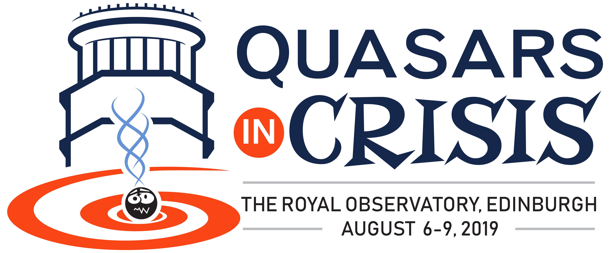

---

layout: wrapper

---

# Description of Meeting

The motivation of our meeting is to make progress connecting the latest observational and theoretical research involving accretion onto massive black holes, e.g. for the "Changing Look" AGN/quasars and TDEs, with particular emphasis on physical processes that we are now observing over short timescales. The "crisis" refers to the severe problems these observations cause for accretion theory, though we welcome any other sense of crisis that attendees care to introduce!

We will keep the programme loosely packed in general, with plenty of time in the schedule for organic discussions arising during both the talks, as well as organized discussion sessions. Note that the meeting takes place during the Edinburgh Festival, so there should be plenty of room for amusing diversion - but you need to book accomodation very early!!

## SOC                     
Chris Done (Durham University)  
Suvi Gezari (University of Maryland)  
Andy Lawrence (University of Edinburgh)  
Chelsea MacLeod (CfA, Harvard)  
Nic Ross (University of Edinburgh)  
Belinda Wilkes (CfA, Harvard)  

## LOC
Philip Best  
Alastair Bruce   
Ines Foidl  
Catherine Heymans  
Andy Lawrence  
Nic Ross

## Contact: [QuasarsInCrisis@gmail.com](mailto:quasarsincrisis@gmail.com)

_Image Credit: S. Gezari_
