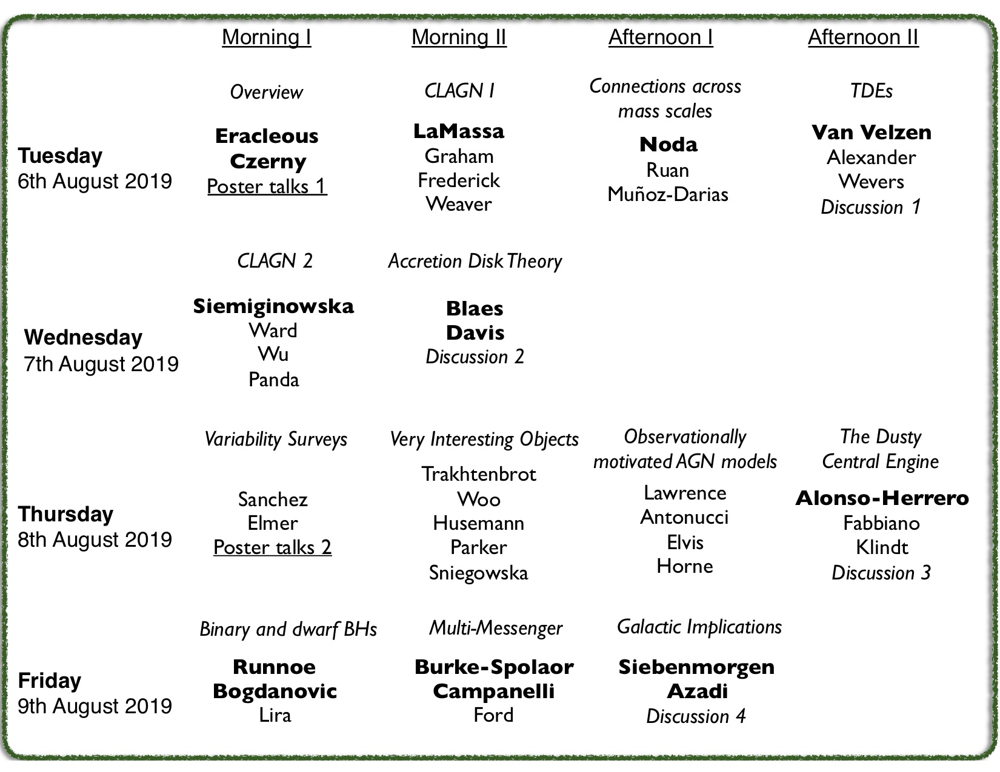

---

layout: wrapper

---
# Timings

We will start at 9:00 on Tuesday, Wednesday and Friday, and at 0930 on Thursday (a very slight concession to post-conference-dinner heads.). We will finish around 17:30 on Tuesday and Thursday. On Wednesday we will finish at lunchtime, and have a free afternoon. On Friday we will finish mid-afternoon.

# Science Programme

We are deliberately leaving some flexibility/discussion time in the programme, and so have set out the structure as a "block programme" as shown below. 

Here is the booklet of [talk/poster abstracts](assets/pdf/QiC_Abstracts_v1pnt1.pdf).

# Discussion sessions

These are evolving, but look likely to be:

Tuesday: "Lets not re-invent the [AGN crisis] wheel"  
Wednesay: "Current roadblocks in Accretion Disk Theory"  
Thursday: "Grumpy Questions Answered"  
Friday: "Crisis? What Crisis"  

Hopefully these titles give quite a lot of flexibility.

# Social Programme

**Welcome Reception**: 
Monday, 5:00-7:00pm at the Higgs Center for Innovation on the ROE site. 
Drinks (alcoholic and soft) will be provided. Some nibbles too. 

**Free afternoon**:
Wednesday afternoon has been left open. You can carry on scientific discussions, or self-organise outings - whatever you like!

**Conference Dinner**:
Wednesday, 8:30pm at <a href="https://www.vittoriagroup.co.uk/vittoriabridge/">Vittoria on the Bridge</a>, 19 George IV Bridge. If you have booked but haven't yet made your menu choice, please asap at the <a href="https://edinburgh.onlinesurveys.ac.uk/quasars-in-crisis-additional-information">online survey link</a>. We still have space available for `Plus Ones’, family members and other guests, but let us know as soon as possible at quasarsincrisis@gmail.com. The full menu is £50. The ‘Young Adults’ menu is £35. 

**Other possible visits/events**:
For those interested in some history, we could arrange some private viewings of the famous Crawford collection of ancient astronomical books, and perhaps a visit to Calton Hill, the historic home of the Royal Observatory.

